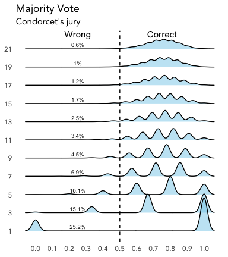
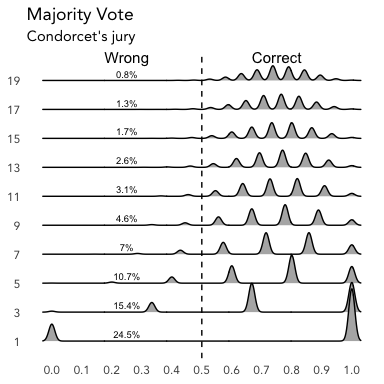
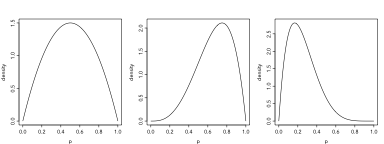
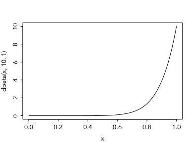
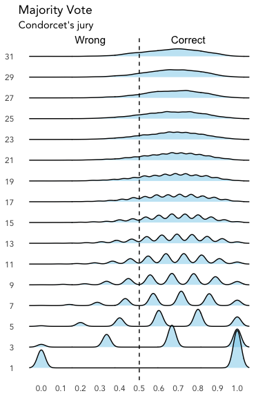
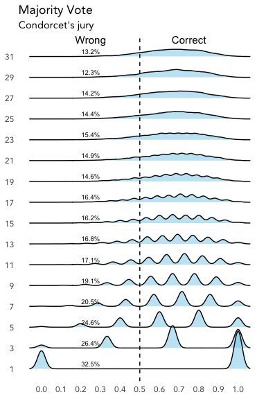
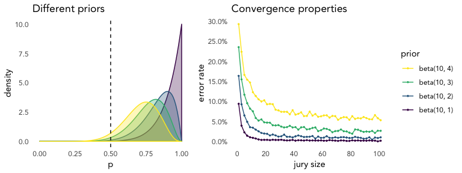

Introduction
================

Taken from: Scott E. Page. (2018). *The Model Thinker*. Basic Books, Chapters 1-4

------------------------------------------------------------------------

**The lattice of models**

The models in this book offer a collection that spans multiple disciplines. All these modesl share a common form: they assume a set of entities (e.g. people or organizations) and describe how they interact.

These models share three characteristics:

1.  *They simplify*: stripping away unnecesary details, abstracting from reality, or creating anew from whole cloth.

2.  *They formalize*, they use precise definitions in mathematical form. For example, a model might represent beliefs as probability distributions over states of the world.

3.  *They are wrong*. This is true of all models: they simplify, they omit details (sometimes crucial ones).

------------------------------------------------------------------------

**Three types of models**

1.  *Simplifications of the world* (the embodiment approach). These models include the important parts of a problem, while stripping away (or lumping together) the less salient parts of a problem.

    This approach takes a *realist* view of models.

2.  *Mathematical analogies*. This approach simplifies a problem by making unrealistic assumptions.

    The spherical cow: to estimate the amount of leather in a cowhide, we *assume* a spherical cow. We do this for mathematical convenience: we know how to integrate over tan(*x*) and cos(*x*), but not over cow(*x*).

    We usually judge these models by their predictive accuracy.

3.  *The alternative reality approach*. These models function as analytic and computational playgrounds in which we can explore possibilities. This is what we do with *agent-based models* or with "small-world" models (e.g. Watts & Strogatz 1998). In this scenario, computer simulations become an important tool.

    Unlike the first approach, these two approaches take an *instrumental* view of models.

------------------------------------------------------------------------

**The seven uses of models** (REDCAPE)

\[R\] **Reason**. *To identify conditions and deduce logical implications.*

While it's true that the conclusions we derive depend on our assumptions, this doesn't mean *all* models deliver tautologies. The logical implications of models are sometimes unexpected (e.g. *Arrow's impossibility theorem*). Other times will solve paradoxes (e.g. *Simpson's paradox*). And sometimes they will simply uncover mathematical relationships (e.g. prices and marginal costs).

Above all, *logic reveals the conditionality of truths*. They identify the conditions under which certain claims hold or don't.

> Critics of formalism claim that models repackage what we already know, that they pour old wine into shiny mathematical bottles, that we do not need a model to know that two heads are better than one or that he who hesitates is lost. We can learn the value of commitment from reading of Odysseus tying himself to the mast. That criticism fails to recognie that inferences drawn from models take conditional forms: if *A* holds, then *B* follows. Lessons drawn from literature or proverbial advice from great thinkers often provide no conditions. If we try to lead our lives or manage others by unconditional truths, we find ourselves lost in a sea of *opposite proverbs* \[18\].

How can we choose between the following list without knowing which conditions make them true?

| Proverb                              | Opposite                           |
|:-------------------------------------|:-----------------------------------|
| Two heads are better than one        | Too many cooks spoil the broth     |
| He who hesitates is lost             | A stitch in time saves nine        |
| Tie yourself to the mast             | Keep your options open             |
| The perfect is the enemy of the good | Do it well or not at all           |
| Actions speak louder than words      | The pen is mightier than the sword |

\[E\] **Explain**. *To provide (testable) explanations for empirical phenomena.*

Note that models can also explain *shape*: e.g. network models of influence and contagion often produce S-shape curves.

> As for the claim that models can explain anything: it is true, they can. However, a model-based explanation includes formal assumptions and explicit causal chains. Those assumptions and causal chains can be taken to data. A model that claims that high levels of criminal behavior can be explained by low probabilities of being caught can be tested \[19\].

\[D\] **Design**. *To choose features of institutions, policies, and rules.*

\[C\] **Communicate**. Models improve communication by creating a common representation, thus enabling the transferring of ideas between different communities of inquiry.

\[A\] **Act**. *To guide policy choices and strategic actions.*

\[P\] **Predict**. *To make numerical and categorical predictions of future and unknown phenomena*. Note that prediction differs from explanation.

For example, deep-learning algorithms can predict many things with great accuracy, but they offer little in the way of explanation. On the other hand, some models can explain but have little predictive power. This is related to Elster's disscusion of the fact that we don't know which "social mechanism" will be triggered in any given situation.

\[E\] **Explore**. *To investigate possibilities and hypotheticals*, this is referred to in other places as the "alternative reality approach".

The Science of many models
--------------------------

**Many models as independent lies**

1.  *The Condorcet jury theorem*

This model was constructed to explain the advantages of majority rule. Page creates an analogy between decisions made by many people and conclusions reached by many models.

*Each of an odd number of people classifies an unknown *state of the world* as either true or false. Each person classifies correctly with a probability *p* &gt; 0.5. We assume that these probabilities are each drawn independently from each other.*

***Condorcet jury theorem**: A majority vote classifies correctly with higher probability than any person, and as the number of people becomes large, the accuracy of the majority vote approaches 100%.*

Even though there's no mathematical exposition, we can create a short simulation to reach similar conclusions.

``` r
majority_rule <- function(N) {
  truth <- "guilty"
  decisions <- vector("character", N)
  p <- runif(N, min = 0.5)  ## assumption of uniformity
  for (i in 1:N) {
    ## i.i.d assumption
    decisions[[i]] <- sample(c("guilty", "inocent"), size = 1, 
                             prob = c(p[i], 1 - p[i]))
  }
  majority_rule <- mean(decisions == truth)
  return(majority_rule)
}

S <- 1e4    ## number of simulations
N <- 11     ## number of committees
output <- vector("list", N)
odd_nums <- seq(1, by = 2, len = N)
names(output) <- odd_nums

for (i in 1:N) {
  output[[i]] <- replicate(S, majority_rule(odd_nums[i]))
}
str(output)
```

    ## List of 11
    ##  $ 1 : num [1:10000] 1 0 1 0 0 1 1 0 1 1 ...
    ##  $ 3 : num [1:10000] 1 1 0.667 0.667 0.667 ...
    ##  $ 5 : num [1:10000] 0.6 0.8 1 0.6 0.8 0.6 0.8 0.6 0.6 0.8 ...
    ##  $ 7 : num [1:10000] 0.429 1 0.429 0.714 0.714 ...
    ##  $ 9 : num [1:10000] 0.556 0.556 0.778 0.556 0.778 ...
    ##  $ 11: num [1:10000] 0.727 0.727 0.818 0.818 0.727 ...
    ##  $ 13: num [1:10000] 0.769 0.923 0.923 0.769 0.692 ...
    ##  $ 15: num [1:10000] 0.667 0.933 0.733 0.733 0.667 ...
    ##  $ 17: num [1:10000] 0.824 0.588 0.647 0.706 0.706 ...
    ##  $ 19: num [1:10000] 0.684 0.842 0.842 0.737 0.789 ...
    ##  $ 21: num [1:10000] 0.952 0.714 0.762 0.714 0.81 ...



Here, the percentages represent the simulated error rates for the majority vote. As expected, as *N* becomes larger the accuracy approaches 100%.

Note that creating this simulation forced us to be transparent about the assumptions we make, mainly: *the probabilities that each person reaches a correct conclusion are drawn uniformly and independent from one another*.

1.  *The diversity prediction theorem*

This model relies on opposite types of errors than cancell each other out. It doesn't imply that just *any* collection of models will be accurate; if all models share a common bias, then their average will also contain that bias.

More formaly:

$$
\\underbrace{(\\overline m - v)^2}\_\\text{many-model error} = 
\\underbrace{\\sum\_{i=1}^N \\frac{(m\_i - v)^2}{N}}\_\\text{average-model error} - 
\\underbrace{\\sum\_{i=1}^N \\frac{(m\_i - \\overline m)^2}{N}}\_\\text{diversity of models}
$$

where *m*<sub>*i*</sub> is model *i*'s prediction, $\\overline m$ is the average of the model's predictions, and *v* equals the true value.

**Note.** Our ability to construct many diverse models is limited because the "*independent* juror assumption" is rarely met. Similarly, we can't construct many diverse models because the features that go into different models will often be correlated.

Page finishes this chapter off with a somewhat haphazard discussion the variance-bias tradeoff, overfitting, and bootstrap aggregation (or "bagging"). The idea is that combining predictions from multiple models works best when those predictions are uncorrelated.

Modeling human behavior
-----------------------

> People are *diverse*, we are *socially influenced*, we are *error-prone*, we are *purposive*, and we *learn.* In addition, people *possess agency* -we have the capacity to act. \[...\] Each of this six characteristics are potential model features. If we include a feature, we must decide how much of it to include. How diverse do we make our actors? How much social influence do we include? De people learn from others? How do we define objectives? How much agency do people possess?

For example, to tackle diversity we sometimes assume that behavioral diversity cancels out. And this will only happen if the actions people take are *independent* (i.e. models of normal distributions).

### Rational-choice models

An agent is rational if she makes choices towards *fulfilling a goal*, making the most *efficient* use of resources.

> An individual's preferences are represented by a mathematical utility or payoff function defined over a set of possible actions. The individual chooses the action that maximizes the function's value. In a *game*, that choice may require beliefs about the actions of other players.

In assuming a utility function, we give preferences a coherency that may not exist. These preferences must satisfy certain axioms in order to be representable by a utility function: completeness, transitivity, independence, and continuity.

Suppose we have a choice set *X* = {*x*<sub>1</sub>, *x*<sub>2</sub>, …, *x*<sub>*n*</sub>} that contains all available alternatives (e.g. stuff to buy, decisions to make).

-   Completeness: all pairs of alternatives can be compared.

-   Transitivity: a logical order can be established among them: if *x*<sub>1</sub> ≽ *x*<sub>2</sub> and *x*<sub>2</sub> ≽ *x*<sub>3</sub>,then *x*<sub>1</sub> ≽ *x*<sub>3</sub>.

-   Independence of irrelevant alternatives.

-   Continuity: if we have *x*<sub>1</sub> ≽ *x*<sub>2</sub> ≽ *x*<sub>3</sub>, then there exists a probability *p* such that *x*<sub>2</sub> = *p* *x*<sub>1</sub> + (1 − *p*)*x*<sub>3</sub>.

People will violate this axioms under any number of circumstances, leading to a widespread skepticism of rational-actor models. Page responds to these criticisms with four arguments.

<table style="width:88%;">
<caption><strong>Arguments for Rational Choice</strong></caption>
<colgroup>
<col width="8%" />
<col width="79%" />
</colgroup>
<tbody>
<tr class="odd">
<td><strong>&quot;As if&quot;</strong></td>
<td>Intelligent rule-based behavior may be indistinguishable from optimal or near-optimal behavior</td>
</tr>
<tr class="even">
<td><strong>Learning</strong></td>
<td>In situations that are repeated, people should approach optimal behavior</td>
</tr>
<tr class="odd">
<td><strong>Large stakes</strong></td>
<td>On important decisions, people gather information and think slowly</td>
</tr>
<tr class="even">
<td><strong>Uniqueness</strong></td>
<td>Optimal behavior is often unique, making the model testable/ tractable</td>
</tr>
<tr class="odd">
<td><strong>Consistency</strong></td>
<td>Optimal behavior creates a consistent model. If people learn the model, they will not change their behavior</td>
</tr>
<tr class="even">
<td><strong>Benchmark</strong></td>
<td>Optimal behavior provides a benchmark as an <em>upper bound</em> on people's cognitive abilities</td>
</tr>
</tbody>
</table>

The consistency argument is related to "Lucas' critique", discussed near the end. Basically, any model that doesn't predict optimal behavior will fail to make long-term predictions when people have something to gain by optimizing their behavior.

Also, numerous studies on "heuristics and cognitive bias" (e.g. *loss aversion* and *hyperbolic discounting*) have shown systematic deviations from rational choice.

These considerations aside, Page argues that we should always be open to the possibility that rational-actor models will not solve the problem at hand, and that we should privilege other models instead.

### Rule-based models

Whereas optimization-based models assume an underlying utility or payoff function that people maximize, rule-based models assume specific behaviors. Many people equate optimization-based models with mathematics and rule-based models with computation, but this distinction is not very clean.

**Fixed rules**. A fixed rule applies the same algorithm (or decision making protocol) at all times. This will provide a *lower bound* on people's cognitive abilities. For example, "zero intelligence" is sometimes used as a fixed rule in markets: zero-intelligence traders accept *any* offer that produces a payoff. Remarkably, encoding this rule in a computer model results in nearly efficient outcomes.

**Adaptive rules**. An adaptive rule switches among a set of behaviors, evolves new behaviors, or copies the behaviors of others in order to improve a payoff. Thus, adaptive rules requiere a utility or payoff function. People like Gerd Gigerenzer argue that people tend toward simple and effective rules within any given situtation, and that if that's what people do, then we should model them this way.

Note that rule-based models make no explicit assumption about rationality, but adaptive-rule models exhibit "ecological rationality" (i.e. better rules eventually predominate).

**How smart should we make the actors in our models?**

It depends on what type of outcome is produced by the model. We have four options: *equilibrium*, *cycles*, *randomness*, or *complexity*. If the model produces randomness at an agregate level, then it's safe to say that individuals probably can't learn anything (i.e. they *can't* choose optimally). The models that produce cycles or equilibria, on the other hand, create a *stationary environment* in which we expect people to learn.

Notice that if adaptive rules produce an equilibrium, then the equilibrium should be consistent with behavior by optimizing agents. Otherwise, optimal behavior will be an unrealistic assumption in complex situations.

**The Lucas critique**. If people learn, then we cannot rely on past data to predict outcomes under a policy change. This insight is a variant of *Campbell's law*, which states that people respond to any measure in ways that render it less effective. Thus, models must take into account the fact that people respond to policy and environmental changes.

Revisiting Condorcet's jury theorem
-----------------------------------

The code that simulates Condorcet's jury theorem can be viewed from a Bayesian framework as a **prior predictive distribution**.

Here, our uniformity assumption can be seen as a *prior* on the probability that each individual juror will arrive at the correct verdict.

> A prior predictive simulation means simulating predictions from a model, using only the prior distribution instead of the posterior distribution. This is very useful for understanding the implications of a prior (McElreath, forthcoming).

The default prior used for the previous simulation is as follows:



But we can use any sort of prior distribution, conveniently parameterized as a beta distribution.

For example:



Lets create a stan program that makes the previous simulation to see how this works out.

``` r
readLines("programs/condorcet.stan") %>% 
  writeLines()
```

    data {
      int N;
      int odd_vector[N];
      real beta_params[2];
    }
    generated quantities {
      matrix[4000, N] S;   // 4,000 simulations for each jury size
      for (i in 1:4000) {
        for (j in 1:N) {
          real p;
          p = beta_rng(beta_params[1], beta_params[2]);
          S[i, j] = binomial_rng(odd_vector[j], p);
        }
      }
    }

``` r
condorcet_jury <- stan_model("programs/condorcet.stan")

simulation <- function(odd_nums, params, plot = FALSE) {
  stopifnot(length(params) == 2)
  
  ### Stan simulation
  stan_data <- list(N = length(odd_nums),
                    odd_vector = odd_nums,
                    beta_params = params)
  simulation <- sampling(condorcet_jury, chains = 1, iter = 1,
                       algorithm = "Fixed_param",
                       data = stan_data)
  output_matrix <- extract(simulation)$S[1, , ]
  colnames(output_matrix) <- odd_nums
  for (i in 1:length(odd_nums)) { ## Stan doesn't have integer division :(
    output_matrix[ , i] <- output_matrix[ , i] / odd_nums[i]
  }
  
  ### ggplot2 graph (OPTIONAL)
  if (plot == FALSE) {
    return(output_matrix)
  } else {
    g <- as_tibble(output_matrix) %>% 
      gather(key = N, value = output) %>% 
      mutate(N = factor(N, levels = odd_nums)) %>%
      ggplot(aes(x = output, y = N)) +
      ggridges::geom_density_ridges(bandwidth = 0.02, 
                                    fill = "skyblue", alpha = 0.5) +
      labs(x = NULL, y = NULL, title = "Majority Vote",
           subtitle = "Condorcet's jury") +
      geom_vline(xintercept = 0.5, linetype = "dashed") +
      scale_x_continuous(breaks = seq(0, 1, 0.1)) +
      annotate("text", x = c(0.25, 0.75), y = length(odd_nums) + 1, 
               label = c("Wrong", "Correct"), vjust = 1, size = 4) + 
      theme_minimal(base_line_size = 0, base_family = "Avenir")
  }
    return(list(result = output_matrix, plot = g))
}

S <- simulation(odd_nums = seq(1, 31, 2), params = c(10, 5), plot = TRUE)
```

    ## 
    ## SAMPLING FOR MODEL 'condorcet' NOW (CHAIN 1).
    ## Chain 1: Iteration: 1 / 1 [100%]  (Sampling)
    ## Chain 1: 
    ## Chain 1:  Elapsed Time: 0 seconds (Warm-up)
    ## Chain 1:                0.038752 seconds (Sampling)
    ## Chain 1:                0.038752 seconds (Total)
    ## Chain 1:

This is how the prior looks like:

``` r
plot_settings()
curve(dbeta(x, 10, 5), xlab = "p", ylab = "density", main = "dbeta(10, 5)")
```



And this is the prior predictive simulation:

``` r
S$plot
```



Now, with the error rates:

``` r
error_rates <- apply(S$result, MARGIN = 2, function(x) x < 0.5) %>% 
  colMeans() * 100

S$plot + annotate("text", x = 0.25, y = 1:ncol(S$result), 
                  label = paste0(round(error_rates, 1), "%"),
                  vjust = -0.6, size = 2.5)
```



**Why is there a greater error?**

By assuming a uniform distribution between 0.5 and 1, we assumed that all people where biased towards the truth. In real life, we might have some cases in which people are biased towards being wrong (e.g. *discrimination*). In another context, we might call this unflinching error rate "*irreducible error*".

The original prior established the probabity of some bias against "truth" to be zero.

But our new prior tells a different story. It allows for a 9% chance that any given juror will be biased against "truth"!

``` r
round(pbeta(0.5, 10, 5), 2)
```

    ## [1] 0.09

Let's see the effects of this smallish bias with arbitrary numbers of jurors and different priors.



What's happening here? Bigger jury sizes make error rates converge to a population's prior bias towards reaching "wrong" conclusions.

    ## A beta(10, 4) prior converges to: 4.6% by increasing jury size
    ## A beta(10, 3) prior converges to: 1.9% by increasing jury size
    ## A beta(10, 2) prior converges to: 0.6% by increasing jury size
    ## A beta(10, 1) prior converges to: 0.1% by increasing jury size

This leads to a further research question: *How are we suppose to represent "common bias" in terms of probability distributions?*

Note that we only assessed the "uniformity assumption", we didn't cover the independence assumption!

Additional notes
----------------

-   Scott's discussion about how models reveal "the conditionality of truth" is highly reminescent on Elster's discussion of proverbs and [*mechanisms*](https://www.amazon.com/dp/1107416418/).

-   Scott focuses on an ensemble of models that tackle a problem from different perspectives. At times he refers to *a lattice of models*.

-   On the other hand, BDA3 emphasizes model checking and expansion, thus generating *a sequence of models* that tries to improve upon the previous one.

-   Scott's ensemble view *might* be considered from a Bayesian perspective. I don't know enough about this yet.

    However, see: [Using Stacking to Average Bayesian Predictive Distributions](http://www.stat.columbia.edu/~gelman/research/published/stacking_paper_discussion_rejoinder.pdf).

-   At points, it seems like rule-based models will help make accurate short-term predictions. And optimization-based models will help make long-term predictions, subject to conditions of equilibrium (or cycles). But I wouldn't put any money on this interpretation.

-   Also, this is the first time I've seen Lucas' critique described as a variant of Campbell's law, which makes sense.
